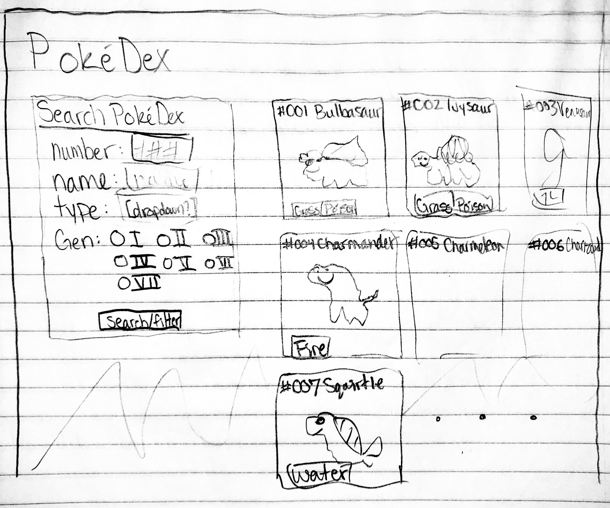
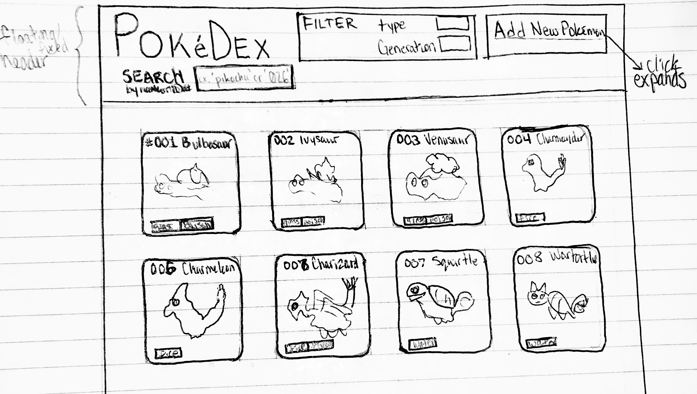

# Project 2, Milestone 1 - Design & Plan

Your Name: **Grace Rieflin**

## 1. Persona

I've selected **Tim** as my persona.

I've selected Tim as my persona because I think that his interest in technology and younger age would be realistic for a user of my site, as it is PokéDex that often attracts his demographic. I also chose him because I am interested in designing for his desire to be able to quickly toggle filters and settings, and I would like to try to design something that would accommodate his fast-moving interactions.

## 2.Describe your Catalog

As a PokéDex, standard fields would be the entry/monster's name, number, (primary) type, (secondary type), their picture, and perhaps which Generation of the game they are from.

## 3. Sketch & Wireframe

#### Sketch

#### Wireframe

If I'm able to implement it, I'd like the "quicksearch" field to be instantaneously displaying results as the user types, which would very much appeal to Tim's 'tinkering' tendencies, as this would allow him to immediately see all results that his search would lead to, without having to fully type his desired name or number then submitting, playing into his incremental processing style, allowing him to easily back-out of a search. Also, rearranging the filtering forms to the top of the site screen allows for more entries to be viewed at-once.

## 4. Database Schema Design

[Describe the structure of your database. You may use words or a picture. A bulleted list is probably the simplest way to do this.]

Table: pokemon
* **nind**: the National PokéDex index number of the Pokémon/monster/entry; in ### (ex. 001) format.
* **name**: the name of the Pokémon/monster/entry;
* **type1**: the (first) type classification of the Pokémon/monster/entry; is one of the list of types.
* **type2**: the second type classification of the Pokémon/monster/entry; is one of the list of types or `null`, if only one type for entry.
* **image**: the image file name for the Pokémon/monster/entry (e.g. "001MS.png", or "null.png" if no image available/given)
* **gen**: the generation number of the Pokémon/monster/entry; int 1-7 or int 0 if no Generation number available/given.

## 5. Database Query Plan

1. All records
  - select all records and fields from the `pokemon` table.
2. Search records by user selected field
  - select all records and fields from the `pokemon` table where `type1 || type2` is `'normal'` (or any other valid type).
  - select all records and fields from the `pokemon` table where `name` contains `'bul'` (where `'bul'` is an example of a user input).
  - select all records and fields from the `pokemon` table where `nind` is `2` (or any other base-digit representation of a National Index number). (When displayed/rendered, these numbers will be converted into 3-digit format, e.g. `'002'`.)
  - select all records and fields from the `pokemon` table where `gen` is `6` (or any other valid generation number represented as an int).
3. Insert record 
  Insert a new record to the table `pokemon` with fields:
    - `name` (*user-input*) as a string of non-special characters;
    - `nind` as the last `nind` in the database +1 (e.g. `807` is the last entry, the next new entry would be `808`);
    - `type1` (*user-input*) as a type selected by the user from a list of existing types (`normal` is default selected);
    - `type2` (*user-input*) as a type selected by the user from a list of existing types or `null` if `None` selected (`None` is default selected);
    - `image` as `"null.png"`, as the default image (I do not wish to allow image uploads for this field);
    - `gen` as `0`, because the user input is not a real Pokémon created in any generation of the game.

## 6. *Filter Input, Escape Output* Plan

##### Filter Input:
  - (Offer only pre-determined, selectable options for fields that allow for this.)
  - Search function:
    - Either only letter characters or only number characters (not both in one search) allowed (no special characters).
    - Searches only `name` field if letters and only `nind` field if 3 digits.
    - *Otherwise, error shown.*
  - Filter function:
    - Select drop-down option. Upon selection, data is filtered by pre-defined values.
  - New Pokémon:
    - `name` only allows letter characters, and will delete any other characters. (This so that the search function accepts entry's name as input.) *This field will also be checked for uniqueness*, as this is the *primary key* of the record to be created.
    - `nind` will not exceed `999` (1000th entry and beyond will not be allowed, as the size of the database will cap at 1000 records).
    - `type` field values can only be selected, not created.
    - `image` cannot be set by the user, as to limit image storage space; default image will always be used for New Pokémon entries.
    - `gen` cannot be set by the user, as to preserve the integrity of the official list of Pokémon.
##### Escape Output:
  - Search Function:
    - Any special characters are not allowed, and the search function does not run if illegal characters are present.
    - use FILTER_... and htmlspecialchars functions with each input to escape.
  - Filter Function:
    - None needed.
  - New Pokémon:
    - use FILTER_... and htmlspecialchars functions to escape for `name` values.

## 7. Additional Code Planning

[If you need more code planning that didn't fit into the above sections, put it here.]

#### Inspiration for design choices:

